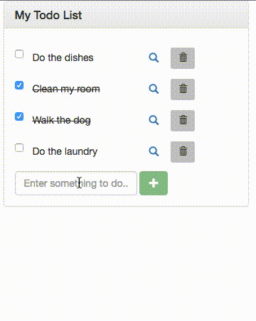

# Angular Breakout: Todo List

A todo list app implemented with AngularJS



## Running the frontend

You can use any simple server you would like to serve static HTML. For this project, I will just use a simple npm module called **serve** that allows you to run a simple HTTP server:

```
npm install -g serve
```

Then, start the frontend server using:

```
serve -p 9000 public/
```

That will start up a server at http://localhost:9000/ that will serve the static HTML files contained in the public/ directory.

## Running the Backend

There is a fake backend implemented using the npm module json-server. To install the module, do:

```
npm install -g json-server
```

Then, **cd** to the `json/` directory and run the following command to start the fake backend API server:

```
json-server --watch db.json
```

By default, the endpoints will be available through http://localhost:3000/
