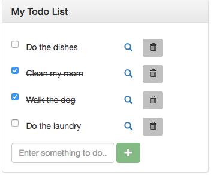
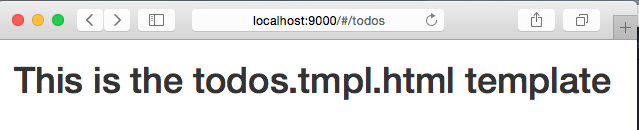
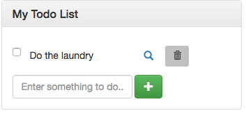
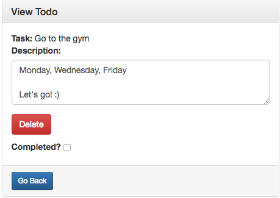

# Tutorial: Making a Todo List with Angular 1.5



## Requirements

You are going to need:
* A browser with Developer Tools (such as Chrome)
* A text editor of your choice (e.g. Atom, Sublime)
* Node

## Specifications

We are going to make a todo list web app using **AngularJS**. We will focus solely on the **frontend** and assume there is already a backend running that serves all the information via JSON.

A `todo` has the following structure:

|field|meaning|
|---|---|
|id|a unique number to identify the todo|
|content|the title of the todo|
|complete |whether the todo has been completed (true/false)|
|description|further description or notes about the todo|

Here is an example of a todo in JSON format:

```
{
  "id": 2,
  "content": "Clean my room",
  "complete": true,
  "description": "My room has been a real mess these days."
}
```

We are going to write an app that performs all the CRUD operations on the collection of todos.

## Single-Page Application

The goal here is to build a single-page application app that is completely decoupled from the backend. That is, we are going to use a frontend JavaScript framework that will run by itself, separate from the backend. The backend will just be a JSON API that serves information upon request. To simulate that backend, we will be using a fake JSON server. More on that later.

## Setting up the Initial Structure

Let us get started by creating some directories and some plain files.

```
mkdir json
touch json/db.json

mkdir public/
touch public/index.html public/app.js
```

The above will create a `json/` directory with a `db.json` file inside. That will be used for our fake backend. Place the following contents inside db.json:

```
{
  "todos": [
    { "id": 1, "content": "Do the dishes", "complete": false, "description": "" },
    { "id": 2, "content": "Clean my room", "complete": true, "description": "My room has been a real mess these days. I have to get myself to do some cleaning." },
    { "id": 3, "content": "Walk the dog", "complete": true, "description": "" },
    { "id": 4, "content": "Do the laundry", "complete": false, "description": "There are about 5 piles of laundry to do. I have been putting it off for too long. C'mon, let's do it! Just get yourself moving! I gotta do it... I really have to do it." }
  ]
}
```

The `public/` directory will be used to store the files for the app itself. Inside `public/`, you will have `index.html`, the entry point for your application, and `app.js`, where we will set up our Angular application. To get started on the HTML, add the following to `index.html`:

```
<!DOCTYPE html>
<html ng-app="todoList">
  <head>
    <meta charset="utf-8">
    <meta http-equiv="X-UA-Compatible" content="IE=edge">
    <meta name="viewport" content="width=device-width, initial-scale=1">

    <title>Angular Breakout: Todo List</title>

    <!-- Bootstrap CSS -->
    <link rel="stylesheet" href="https://maxcdn.bootstrapcdn.com/bootstrap/3.3.6/css/bootstrap.min.css" integrity="sha384-1q8mTJOASx8j1Au+a5WDVnPi2lkFfwwEAa8hDDdjZlpLegxhjVME1fgjWPGmkzs7" crossorigin="anonymous">
    <link rel="stylesheet" href="https://maxcdn.bootstrapcdn.com/bootstrap/3.3.6/css/bootstrap-theme.min.css" integrity="sha384-fLW2N01lMqjakBkx3l/M9EahuwpSfeNvV63J5ezn3uZzapT0u7EYsXMjQV+0En5r" crossorigin="anonymous">
  </head>
  <body>

    <div class="container">
      <div ui-view></div>
    </div>

    <!-- jQuery -->
    <script src="https://cdnjs.cloudflare.com/ajax/libs/jquery/2.2.4/jquery.min.js"></script>
    <!-- AngularJS -->
    <script src="https://cdnjs.cloudflare.com/ajax/libs/angular.js/1.5.7/angular.min.js"></script>
    <!-- Angular UI Router -->
    <script src="https://cdnjs.cloudflare.com/ajax/libs/angular-ui-router/0.3.1/angular-ui-router.min.js"></script>
    <!-- Bootstrap JS -->
    <script src="https://maxcdn.bootstrapcdn.com/bootstrap/3.3.6/js/bootstrap.min.js" integrity="sha384-0mSbJDEHialfmuBBQP6A4Qrprq5OVfW37PRR3j5ELqxss1yVqOtnepnHVP9aJ7xS" crossorigin="anonymous"></script>
    <!-- Custom Scripts -->
    <script src="app.js"></script>
  </body>
</html>
```

Let's break down what is going on in the index file.

We add the **ng-app** "attribute" (actually called an Angular directive) to the `<html>` tag to give control of our page to Angular. Essentially that makes the whole page an Angular app, whose name is given by whatever you defined in the attribute (in this case, we are calling our app `todoList`). You only need to do this once for the whole application.

Then, in the `<head>`, we add some meta tags for responsiveness before `<title>` because I chose to use Bootstrap as the user interface framework. You are free to choose whatever framework you like or even not use one at all. Note we place the link to the Bootstrap CSS styles after the `<title>` tag.

For the `<body>`, we place all the necessary scripts at the bottom, right before the end of the body tag. Those scripts are, in order: jQuery, AngularJS, Angular UI Router, Bootstrap, and your custom script (`app.js`) that will hold the actual application code. I added jQuery and Bootstrap scripts there because they go together, although they are not necessary; you just need the script for Angular and the script for UI Router to build a simple Angular app. The [latter](https://github.com/angular-ui/ui-router) is an Angular module that is highly preferred over the built-in Angular router called `ngRoute`.

Between `<body>` and the scripts at the bottom, we have a div that will hold the main content of the app. We will be using only one main content view for this application. The page templates will all be rendered in the div whose attribute has the directive `ui-view`:

```
<div ui-view></div>
```

Note that we used CDN links for all the styles and external scripts. Feel free to download them locally if you prefer.

## Defining the Initial App Script

Now let us write some code in `app.js` to define our Angular application in JavaScript. Add the following to `app.js`:

```javascript
angular.module('todoList', ['ui.router'])

  .config(function($stateProvider, $urlRouterProvider) {
    // The default route if request does not match any of the specific routes below
    $urlRouterProvider.otherwise('/todos');

    // Specify all the routes (called states) here
    $stateProvider
      .state('todos', {
        url: '/todos',
        templateUrl: 'todos/todos.tmpl.html',
        controller: 'TodosCtrl',
        controllerAs: 'ctrl',
      })
      ;
  })
  ;
```

In the script above, we define a module to hold our todoList app. The first argument to `angular.module()` is the name of the app and the second argument is an array of all the dependencies or external modules you will be using. You should pass the array of dependencies (even if empty) the first time you call `angular.module()` to create a new module. Here we are just using one external module: `ui.router`.

After setting up the module, we chain the function call to the config() method to set up all the routes (called states) for UI Router. You will need two arguments for the callback provided to config: $stateProvider and $urlRouterProvider.

You use **$urlRouterProvider** to set up the default route if the user tries to go somewhere you have not defined a specific route. In this case, we want to point the user to `/todos` in case that happens. This is somewhat similar to defining a root route.

Then, you use **$stateProvider** to set up all the routes for the application. Each route is set up using the state() function, that takes as parameters first the name of the state and then an object with options for that specific state (aka route). The most basic parameters for a state would be **url** and **template** (or **templateUrl** if not an inline template).

Here we use `/todos` as the URL and `todos/todos.tmpl.html` as the template file (which we will be creating later). You can also add a **controller** to the specific route. In this case, we will be creating a `TodosCtrl` later and using it for this route. Using the `controllerAs` property allows you to refer to the controller by an alias. I chose "ctrl" to be short and clear. Otherwise, you would have to type TodosCtrl every time you wanted to access a property stored in the controller.

## Making the Todos Template

Now that we have our first route in place, let us make the template for that route. Create a directory named `todos` within the `public/` directory and create the todos.tmpl.html file:

```
mkdir public/todos
touch public/todos/todos.tmpl.html
```

You could named your template whatever you want, I just chose `.tmpl.html` as my convention for template filename extensions. Inside that file, type in something arbitrary just as a placeholder for now:

```
<h1>This is the todos.tmpl.html template</h1>
```

## Getting the System Up and Running

Now with our first template in place and the states (aka routes) all set up, let us power up our app and see what it looks like. For that, we will be using a Node module called **serve** to start a simple frontend server. You can install it using:

```
npm install -g serve
```

Then, run the server from the app root directory using:

```
serve -p 9000 public/
```

You can access your web application at http://localhost:9000/



After accessing the application using the browser, you will notice the URL was redirected to `/#/todos`, which makes sense because we set that as the default route. You will see your placeholder text in that page, indicating everything went well and you app is running fine.

We got the basic structure of the app laid out pretty well, now let us turn to making a controller for the `todos` state (i.e. `/todos` route).

## Creating the TodosCtrl and TodosModel

We will associate a **controller** with each view in our app. Every time the todos template page is loaded, its controller will also be loaded. In that controller, we will store the list of todo items in an array. But the data will come from a **service** that, in turn, will query the backend for the information. The service will pass a **promise** back to the controller. It  will then have to handle that promise and perform the right operations accordingly in order to modify the view and make the data appear in sync with the backend.

Create the file todos-controller.js:

```
touch public/todos/todos-controller.js
```

Then add the following contents:

```
angular.module('todoList')
  .controller('TodosCtrl', ['TodosModel', function(TodosModel) {

  }]);
```

The first argument to the controller is its name. The second argument is, if there is no dependency injection, just an anonymous function that defines the controller. In our case, we are [injecting](https://docs.angularjs.org/guide/di) TodosModel, which is the name of the **service** that we will be creating next to communicate with the backend. Because of that, we have to make the second argument of the controller to be an array.

To create the TodosModel file, create the following file structure:

```
mkdir -p public/common/models
touch public/common/models/todos-model.js
```

I placed the todos-model.js under the directory common/ because the service will be shared between different controllers. This is just a file structure convention I chose to follow; you can choose your own.

Add the following to todos-model.js:

```
angular.module('todoList')
  .service('TodosModel', ['$http', 'ENDPOINT_URI', function($http, ENDPOINT_URI) {

  }]);
```

Again, we are just defining the TodosModel, but not doing anything in particular there. We inject the $http service in order to be able to make requests to the backend. Then, we need to inject an ENDPOINT_URI constant that will hold the backend location. For our purposes, we will be just defining that constant in `app.js`, in between `angular.module` and `.config`:

```javascript
angular.module('todoList', ['ui.router'])

  // Define the URL that will be used to hit the backend API
  .constant('ENDPOINT_URI', 'http://localhost:3000/')

  .config(function($stateProvider, $urlRouterProvider) {
```

Before moving on, let us not forget to add the new js files we made to our list of scripts in `index.html`:

```
<!-- Custom Scripts -->
<script src="app.js"></script>
<script src="common/models/todos-model.js"></script>
<script src="todos/todos-controller.js"></script>
```

## Going back to the Template

If you reload your app, you will see nothing has changed. That is because there is nothing going on in the controller. Let us go back to the todos.tmpl.html template and fill it up with some mock information. I am going to use a Bootstrap panel as the container for the todo list. Feel free to come up with your own user interface, if you wish.

```
<div class="row">
  <div class="col-xs-10 col-xs-offset-1 col-sm-6 col-sm-offset-3">
    <div class="panel panel-default">

      <div class="panel-heading"><h3 class="panel-title">My Todo List</h3></div>

      <div class="panel-body">
        <div class="checkbox">
          <label>
            <input type="checkbox">
          </label>
          <input type="text" class="todo-item" value="Do the laundry">
          <a class="btn"><span class="glyphicon glyphicon-search" aria-hidden="true"></span></a>
          <button class="btn btn-sm">
            <span class="glyphicon glyphicon-trash" aria-hidden="true"></span>
          </button>
        </div>

        <form class="form-inline" novalidate>
          <div class="form-group">
            <input class="form-control" type="text" placeholder="Enter something to do..." required>
            <button class="btn btn-success" type="submit">
              <span class="glyphicon glyphicon-plus" aria-hidden="true"></span>
            </button>
          </div>
        </form>
      </div>

    </div>
  </div>
</div>
```

Also, define some custom CSS to eliminate the border of `<input>` text elements, except on hover, and some CSS to strike through completed items.

```
touch public/stylesheet.css
```

Add the following to `stylesheet.css`:

```
.completed-task {
  text-decoration: line-through;
}

.todo-item, .todo-item-description {
  border: none;
  border-color: transparent;
}

.todo-item:hover {
  border: 1px solid black;
  border-radius: 3px;
  cursor: pointer;
}
```

Don't forget to include the style using a `<link>` tag, right before the end of the `<head>` tag, after including the CSS for Bootstrap:

```
<link rel="stylesheet" href="stylesheet.css">
```

As a note, not all those styles will not be working right away. We will be using the Angular directive `ng-class` to dynamically apply classes later on, given the state of a todo item. For example, we will apply the  `.completed-task` class only if the item's `complete` attribute has been set to true.



Ultimately, we will have a list of todo items and each todo item can be crossed out or deleted completely. Furthermore, you can inspect each todo item to go to the "notes" page, where you will see a more detailed description for the todo. At the bottom, you have the option of creating a new todo item.

## Talking to the Backend: Defining the Service

Before we can go on and set up the controller to modify the view, let us define a service to communicate with the backend and talk to the controller. Usually one would start by defining the controller for the template and make some mock data variables there. Then, as you develop the app, you would promote that data to a service, which in turn you would promote to a backend and would use the service to only communicate with that backend. But here we are going to first build the service, so that the controller will have access to it. Then, we will build the controller to call upon the service to provide information that will be rendered in the view.

Inside `todos-model.js`, add the following functions:

```javascript
angular.module('todoList')
  .service('TodosModel', ['$http', 'ENDPOINT_URI', function($http, ENDPOINT_URI) {
    var service = this;

    service.all = function() {
      return $http.get(ENDPOINT_URI + "todos");
    };

    service.fetch = function(todoId) {
      return $http.get(ENDPOINT_URI + "todos/" + todoId);
    };

    service.create = function(todo) {
      return $http.post(ENDPOINT_URI + "todos", todo);
    };

    service.update = function(todoId, todo) {
      return $http.put(ENDPOINT_URI + "todos/" + todoId, todo);
    };

    service.destroy = function(todoId) {
      return $http.delete(ENDPOINT_URI + "todos/" + todoId);
    };

  }]);
```

Each function is just performing a request to the backend for a specific CRUD operation. For example, the all() function asks the backend for all the items in the todo list. The $http service is used to make that request to the backend. It is important to note the $http service returns a **promise**, which will be handled in the controller, not here in the service; we need only return that promise from the function.

Side note: I use `var service = this;` just so I do not have to type `this`. Using a more descriptive variable name might be less confusing than just having `this`, which might be ambiguous in JavaScript. You are welcome to just use `this`.

The argument to `$http.get()` is just the ENDPOINT URI used to hit the backend. Here, for the all() function, we are actually just doing:

```
return $http.get('http://localhost:3000/todos');
```

Remember that the ENDPOINT_URI constant is defined in `app.js` and was injected into the TodosModel so we can use it.

The endpoints follow a RESTful API, so it should be no trouble for you to understand. Now let us power up our fake backend using JSON server. First install the npm module:

```
npm install -g json-server
```

Then, **cd** to the `json/` directory and run the command:

```
json-server --watch db.json
```

By default, the backend API will be available at http://localhost:3000/

## Defining the Controller

With the service now in place, we can proceed to define the controller and finally be able to render some data in the template. Add the following code to `todos-controller.js`:

```javascript
angular.module('todoList')
  .controller('TodosCtrl', ['TodosModel', function(TodosModel) {
    var ctrl = this;

    ctrl.newTodo = {
      content: ""
    };

    ctrl.getTodos = function() {
      TodosModel.all()
        .then(function(response) {
          ctrl.todos = response.data;
        })
        .catch(function(error) {
          console.log("Error loading todos:");
          console.log(error);
        })
        .finally(function() {
          console.log("Finished loading all todos :)");
        });
    };

    ctrl.addTodo = function(todo) {
      TodosModel.create(todo)
        .then(function(response) {
          // Update list of todos on the current view
          ctrl.getTodos();
        })
        .catch(function(error) {
          // handle error here
        })
        .finally(function() {
          ctrl.newTodo = {
            content: ""
          };
        });
    };

    ctrl.updateTodo = function(todo) {
      console.log("updateTodo!")
      TodosModel.update(todo.id, todo)
        .then(function(response) {
          // Update list of todos on the current view
          ctrl.getTodos();
        });
    };

    ctrl.deleteTodo = function(todoId) {
      TodosModel.destroy(todoId)
        .then(function(response) {
          ctrl.getTodos();
        });
    };

    // Retrieve all the todos the first time the view is loaded
    ctrl.getTodos();
  }]);
```

The first line in the controller is `var ctrl = this;`, something I used to be more clearer about the context for each of the functions I defined. You can instead just use `this.whatever` to define all the functions in the controller. I do not recommend using `$scope` because that will go away in Angular 2. Rather, just stick to using `this` and `controllerAs` to achieve the same outcome.

Before defining all the functions to establish communication between the controller and the service, I create a new object (`ctrl.newTodo`) that will represent the new todo item at the bottom of the template, the one with the plus `+` sign next to it. That object only has a `content` property, which will be eventually bound to the `<input>` text via two-way data binding.

There are four function definitions in the controller:

* ctrl.getTodos()
* ctrl.addTodo()
* ctrl.updateTodo()
* ctrl.deleteTodo()

They all call upon the `TodosModel` to perform either of those operations:

* all()
* fetch()
* create()
* update()
* destroy()

At the end of the controller definition, we just call `ctrl.getTodos()` to retrieve all the todo items for display in the template. Every time you go to the route `/todos`, the template and controller will be rebuilt and that function will get called to make sure the template has access to all the todos. That is, variables defined in the controller via `this` (or `$scope`) will also be available in the template.

Let us now focus on the `ctrl.getTodos()` function: we call the function `TodosModel.all()` and then we have to handle the **promise** that is passed back from that service function. Keep this in mind: in the controller we are just going to handle the **promise** passed back from the servie using the following pattern:

```javascript
TodosModel.something()
  .then(function(response) {
    // Do something if we got the data successfully
  })
  .catch(function(error) {
    // Handle the error
  })
  .finally(function() {
    // Do something no matter what after got some response back (with/without error)
  });
```

I might not use all the three (then, catch, finally), but at least have a `then` to do something in case you get some response sucessfully.

With that in mind, look at the definition for getTodos():

```
ctrl.getTodos = function() {
  TodosModel.all()
    .then(function(response) {
      ctrl.todos = response.data;
    })
    .catch(function(error) {
      console.log("Error loading todos:");
      console.log(error);
    })
    .finally(function() {
      console.log("Finished loading all todos :)");
    });
};
```

If we successfully query the todo items from the backend, we will take those items and store in the `ctrl.todos` variable that belongs to the controller itself. Otherwise, we will just console log the error. We also use a `finally` to demonstrate its use (you will always get the message saying the todos were loaded, no matter what).

When you want to create a todo, you just call ctrl.addTodo() and pass the new todo as an argument. In this case, we will actually be passing `ctrl.newTodo`, which was defined in the beginning of the controller definition, from the template as we attach an event to call addTodo() when the new todo item inside `<input>` is submitted. For the `finally`, we clear up the newTodo variable to allow room for a new todo once the old one has been submitted.

For the `ctrl.updateTodo()` function, you also pass the todo that will be updated.

For `ctrl.deleteTodo()`, you just pass the id of the todo item that will be destroyed.

The pattern found in the functions defined in `todos-controller.js` will be useful when defining other controllers, as all you have to do is pretty much copy and paste those patterns.

## Adjusting the Todos Template for Dynamic View

Now let us turn that mock template into an actual list of todo items that updates dynamically and talks to the backend via the controller TodosCtrl through the TodosModel service.

We already defined TodosCtrl as the controller for the todos.tmpl.html template when we defined our routes in `app.js`.

Update the `todos.tmpl.html` file with the following:

```
<div class="row">
  <div class="col-xs-10 col-xs-offset-1 col-sm-6 col-sm-offset-3">
    <div class="panel panel-default">

      <div class="panel-heading"><h3 class="panel-title">My Todo List</h3></div>

      <div class="panel-body">
        <div ng-repeat="todo in ctrl.todos">
          <div class="checkbox">
            <label>
              <input
                type="checkbox"
                ng-change="ctrl.updateTodo(todo)"
                ng-model="todo.complete">
            </label>
            <input
              type="text"
              ng-class="[{'completed-task': todo.complete}, 'todo-item']"
              ng-blur="ctrl.updateTodo(todo)"
              ng-model="todo.content">
            <a class="btn" ui-sref="notes({id: todo.id})"><span class="glyphicon glyphicon-search" aria-hidden="true"></span></a>
            <button class="btn btn-sm" ng-click="ctrl.deleteTodo(todo.id)">
              <span class="glyphicon glyphicon-trash" aria-hidden="true"></span>
            </button>
          </div>
        </div>

        <form name="ctrl.createForm" class="form-inline" ng-submit="ctrl.addTodo(ctrl.newTodo)" novalidate>
          <div class="form-group">
            <input class="form-control" type="text" ng-model="ctrl.newTodo.content" placeholder="Enter something to do..." required>
            <button class="btn btn-success" type="submit" ng-disabled="ctrl.createForm.$invalid">
              <span class="glyphicon glyphicon-plus" aria-hidden="true"></span>
            </button>
          </div>
        </form>
      </div>

    </div>
  </div>
</div>
```

We use the **ng-repeat** directive to generate a div for each todo item. The way that works is that you say:

`ng-repeat="todo in ctrl.todos"`

And it works similar to a for loop: for every "iteration", it makes a div with the data available as "todo", retrieved from the array of todos called `ctrl.todos`, which is defined in the controller.

Angular directives may be attached as custom attributes to HTML or as the tag name themselves. In the code above, there are many directives that work like an HTML attribute. Here is a list and their description:

|directive|description|
|---|---|
|ng-change|when the `<input>` value is modified, will trigger a call to the function given|
|ng-model|binds the `<input>` to a variable defined in the controller|
|ng-blur|when you leave the `<input>`, a trigger will be fired to call the given function|
|ng-click|when the element is clicked, trigger a call to the given function|
|ng-submit|will trigger a call to the given function when the form is submitted|
|ng-disabled|disables the attached element if the given condition is true|
|ng-class|applies the CSS class(es) if given condition is true|

Out of the directives above, one you should remember really well is **ng-model**. With that, you can bind the value of an input field with a JavaScript variable. That is called two-way data binding. To verify that, you can always display the value of some variable in the template using {{somevariable}} inside two curly braces.

You might have noticed that the anchor tag `<a>` for the magnifying glass icon for each todo has a `ui-sref` attribute instead of `href`. That is a directive from Angular UI Router and allows you to change to another state after clicking the link. In our case, it is a link to change to the notes state, passing an object of parameters inside parenthesis. We will be creating that `notes` state next.

Now, it is time for you to check your app and see how it is working. Keep your `db.json` file open while you perform some testing on the browser. You will notice the fake database change as you do CRUD operations on the frontend. Clicking the magnifying glass will not work just yet because we have not defined the `notes` state.


Note: you might modify your original database and erase all the items there. To get it back to its original state, I suggest you keep the file db.json version-controlled at that fixed initial state, so whenever you wanted to "re-seed" the db with initial values, you could just do:

```
git checkout -- json/db.json
```

## Extending the App with a New Template and its Controller

Now let us create a new template that will be the more detailed page about the todo. That will be the page for the magnifying glass link in the `todos` template. Let us call that template `notes`:

```
mkdir public/notes
touch public/notes/notes.tmpl.html
```

Note that we organize our app structure by feature and not by just a specific type of Angular element (like controller or view).
For the `notes.tmpl.html` file, add the following:


```html
<div class="row">
  <div class="col-xs-10 col-xs-offset-1 col-sm-6 col-sm-offset-3">
    <div class="panel panel-default">

      <div class="panel-heading"><h3 class="panel-title">View Todo</h3></div>

      <div class="panel-body">
        <strong>Task:</strong> {{ctrl.todo.content}}
        <div class="form-group">
          <label>Description:</label>
          <textarea
            class="form-control"
            rows="3"
            ng-blur="ctrl.updateTodo(ctrl.todo)"
            ng-model="ctrl.todo.description"></textarea>
        </div>

        <div class="checkbox">
          <button class="btn btn-danger" ng-click="ctrl.deleteTodo(ctrl.todo.id)">
            Delete
          </button>
        </div>

        <label>Completed?
          <input
            type="checkbox"
            ng-change="ctrl.updateTodo(ctrl.todo)"
            ng-model="ctrl.todo.complete">
        </label>
      </div>

      <div class="panel-footer">
        <a class="btn btn-sm btn-primary" ui-sref="todos">Go Back</a>
      </div>

    </div>
  </div>
</div>
```

The code for the notes view is very similar to the one for `todos`, except now we just show one todo item and also its detailed `description` (instead of just its content field).

Recall that to display the value of variables defined in the controller, you can use the double-curly braces notation: `{{ctrl.todo.content}}`.

Everything looks good for the template, except that state is not yet defined. Let us go to the `app.js` file and define the `notes` state:

```javascript
    $stateProvider
      .state('todos', {
        url: '/todos',
        templateUrl: 'todos/todos.tmpl.html',
        controller: 'TodosCtrl',
        controllerAs: 'ctrl',
      })
      .state('notes', {
        url: '/todos/:id/notes',
        templateUrl: 'notes/notes.tmpl.html',
        controller: 'NotesCtrl',
        controllerAs: 'ctrl',
      })
      ;
```

Note how we use URL params inside the url for the notes state: here the **:id** will be some variable URL parameter that will determine which specific todo item you are inspecting. For the templateUrl, we have already created that. Now, this new state will have its own controller, called `NotesCtrl`. Let us go ahead and define that controller. It will be somewhat similar to the `TodosCtrl`, except we just deal with a single todo instead of a collection of todos. Create the file at  `public/notes/notes-controller.js` and add the following contents:

```javascript
angular.module('todoList')
  .controller('NotesCtrl', ['$stateParams', '$state', 'TodosModel', function($stateParams, $state, TodosModel) {
    var ctrl = this;

    ctrl.getTodo = function(todoId) {
      TodosModel.fetch(todoId)
        .then(function(response) {
          ctrl.todo = response.data;
        });
    }

    ctrl.updateTodo = function(todo) {
      TodosModel.update(todo.id, todo)
        .then(function(response) {
          // do nothing
        })
        .catch(function(error) {
          console.log("Failed to update todo #" + todo.id);
        });
    };

    ctrl.deleteTodo = function(todoId) {
      TodosModel.destroy(todoId)
        .then(function(response) {
          // Go back to the list of todos after deleting this specific one
          // You can use $state.go to go to a specific state (aka route)
          // Besides this, using the attribute ui-sref in <a> tags also
          // does the same thing
          $state.go('todos');
        });
    };

    // Retrieve the todo item the first time the controller is loaded
    ctrl.getTodo($stateParams.id);
  }]);
```

For the NotesCtrl, we inject $stateParams so that we have access to whatever was passed through the URL (remember the :id we talked about before). You can access it using simply `$stateParams.id`

We inject `$state` in order to use it to change state (aka route) from the controller. That is done when you delete the todo item using the Delete button. You can just say, for example, `$state.go('todos')`, to change to the `todos` state.

Finally, the last thing injected into the controller is the `TodosModel`, because we need a way to manipulate the todo data in the backend.

The functions in `NotesCtrl` are much like the ones in the `TodosCtrl`, except you just deal with one todo item and you have to specify its id using $stateParams. Recall that to pass parameters via $stateParams, you can use ui-sref as a directive for an anchor tag `<a>` and pass it as an object like so:

```
<!-- example from todos.tmpl.html -->
<a ui-sref="notes({id: todo.id})">...</a>
```

To finish up our application, let us not forget to add the new controller to the list of scripts in `app.js`:

```html
<!-- Custom Scripts -->
<script src="app.js"></script>
<script src="common/models/todos-model.js"></script>
<script src="todos/todos-controller.js"></script>
<script src="notes/notes-controller.js"></script>
```

Now, take a look at the notes page from any of the todo items you might have.



## Conclusion

So we come to the end of this tutorial. You have built an Angular app that has all the CRUD operations in place! Congratulations! Now, you can expand on what you have here and try many new things. Look at the documentation for Angular to find out more about [directives](https://docs.angularjs.org/guide/directive) and ways to make your app more dynamic and interesting.

Here are some suggestions for you:

* Allow the user to add multiple notes (or comments?) for a single todo
* Allow the user to add an image to a todo
* Display a `Loading...` message or animation during the period where you have to wait for the data to be fetched from the backend
* Add user authentication to your app, maybe via [Firebase](https://firebase.google.com/), which you would could then implement as a real backend.
* Try something like [Gridster](https://github.com/ManifestWebDesign/angular-gridster) to make animated todos like a post-it notes

I have been greatly influenced by [Lukas Ruebbelke](https://github.com/simpulton) and his way of building Angular applications. Check out his profile. I also highly recommend his videos on Angular.
